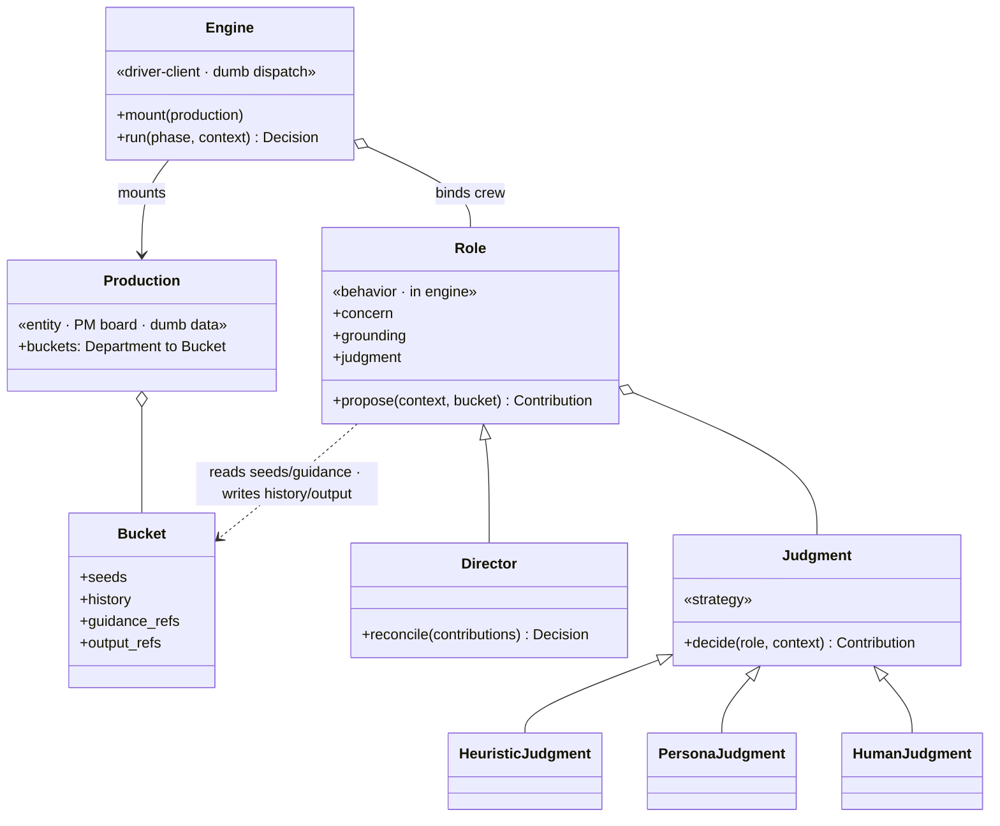
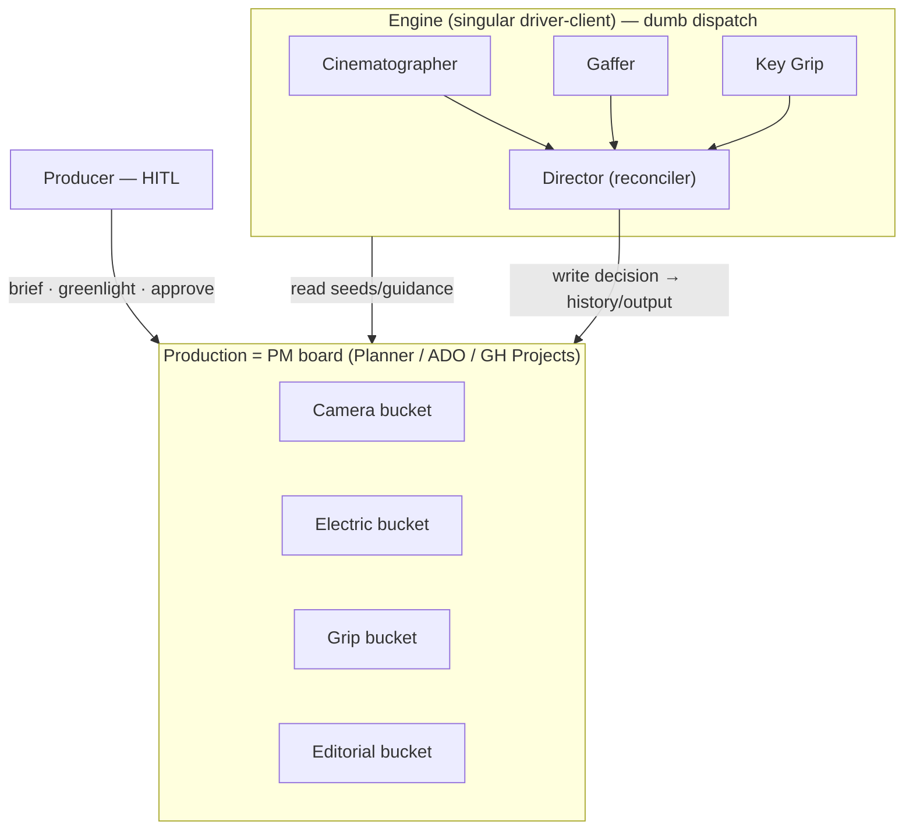

# Sequitur Studios — production workflow architecture

The ultimate vision: not a prompt wrapper, but a **production studio** whose
workflow can fulfill every component requirement of a complete project. We model
that after how a real studio is organized — the crew **roles** of
[Appendix D](../artifacts/grammar%20of%20the%20shot/reference/appendix-d-crew-positions.md)
grouped into **departments**, working across the three **production phases**.

The design principle that ties it together:

> Each department/role owns a responsibility. Every responsibility is served by a
> **grounding source** (in the [grounding library](../artifacts/INDEX.md)) and a
> **code layer** (in `sequitur/`). A user can step into a role and the workflow
> hands them that role's grounded vocabulary and tooling.

Today the studio implements **one department in one phase** — the camera
department during production (the DP's grammar of the shot). Everything else is
scaffolded here as the intended architecture, so subsequent work has a frame to
grow into.

This doc maps **two orthogonal dimensions**: the **craft layers** (immediately
below — *what* the studio composes) and the **runtime model** (further down — *how*
a production is represented, driven, and stored, decided in
[`storyline/0005`](storyline/0005-productions-as-instances-and-output-storage.md)).

## The craft layers, by phase

### Pre-production — *plan*

| Department / role (App. D) | Responsibility | Grounding | Code layer | Status |
|---|---|---|---|---|
| Producer | financing, scheduling, logistics | **Directing** Ch. 25 (line producing) · Ch. 37 (delivery) *(abridged, `0017`)* | **HITL — the human seat** (works the Production/PM board) | decided (`0008`) |
| Screenwriter | script, structure | **The Screenwriter's Taxonomy** (genre/voice/pathway/POV) *([abridged, 8 ch, `0016`](../artifacts/the%20screenwriter's%20taxonomy/INDEX.md))* + **Directing** Ch. 3–8 *(abridged, `0017`)* | `Screenwriter` role · typed genre vocabulary (`crew/screenwriting.py`) | grounded; role planned |
| Director | interpret script → shot selection | **Directing** Ch. 7–11, 17 (aesthetics, POV, style) *(abridged, `0017`)* + Grammar of the Shot Ch. 1 | `Director` role (crew reconciler, `0014`) | partial (`Director`) |
| Casting · Actors | casting, performance | **Directing** Ch. 18–20 *(abridged, `0017`)* — **a new dimension** the architecture did not model | *(unmodeled — future role)* | new (`0015`) |
| Production Designer | sets, costume, color concepts | **Directing** Ch. 23 (visual design) *(abridged, `0017`)* + *(dedicated production-design source still open)* | art/color layer · `ImageStudio` (gpt-image) | partial (image backend) |
| Storyboard Artist · Previs | previsualize the script → a shot-by-shot visual plan | **Professional Storyboarding** (Paez & Jew) *([abridged, 10 ch, `0018`](../artifacts/professional%20storyboarding/INDEX.md))* + Grammar of the Shot Ch. 1–3 | **reference keyframes** (`ImageStudio`) a video shot conditions on · a future `StoryboardArtist` role | grounded (`0018`); role planned |
| Assistant Director | schedule, coverage, shot list | **Directing** Ch. 24–26 *(abridged, `0017`)* + Grammar of the Shot Ch. 1 | shot list / coverage | planned |

### Production — *shoot*  ← **implemented today**

| Department / role | Responsibility | Grounding | Code layer | Status |
|---|---|---|---|---|
| Director · DP · Camera Operator · AC | the shot: framing, composition, angle | Grammar of the Shot (Ch. 1–3) | `ShotSize`, `SubjectView`, `CameraAngle`, `ShootingStyle`, `Composition`, `FocalLength`, `DepthOfField` | **implemented** |
| Gaffer · Electric · Lighting Tech | lighting scheme & quality | Grammar of the Shot (Ch. 4) | `LightQuality`, `LightScheme`, `LightDirection`, `ColorTemperature`, `eye_light` | **implemented** |
| Key Grip · Grip · Dolly Grip | camera support & movement | Grammar of the Shot (Ch. 6) | `CameraMovement`, `MotionSpeed` | **implemented** |
| Sound Mixer · Boom Operator | production sound (diegetic capture) | Grammar of the Edit Ch. 3 + **Rose, *Producing Great Sound*** *([abridged, 18 ch](../artifacts/producing%20great%20sound%20for%20film%20and%20video/INDEX.md))* | `SpeechRenderer` (Azure Speech) + `SoundMixer` role — planned (`0009`) | partial |
| Script Supervisor · DIT | continuity notes, data, on-set color | Grammar of the Shot (Ch. 5) | feeds the edit layer | planned |

### Post-production — *assemble*  ← **the next architectural layer**

| Department / role | Responsibility | Grounding | Code layer | Status |
|---|---|---|---|---|
| Editor | cut, continuity assembly, pacing, transitions | **Grammar of the Edit** (Ch. 1–8, abridged) + **Directing** Ch. 30–34 *(abridged, `0017`)* + Grammar of the Shot Ch. 5 | **sequence / edit layer** (`edit.py` model + `cutter.py` executor) | grounded; code in progress |
| Colorist / DIT | grade, look | **Color Correction Handbook** (Van Hurkman) *([abridged, 10 ch, `0020`](../artifacts/color%20correction%20handbook/INDEX.md))* + Grammar of the Shot (Ch. 4 color) + **Directing** Ch. 36 (grade/finishing) *(abridged, `0017`)* | `crew/colorist.py` role + `grade.py` reified model + `grader.py` *transform* (ffmpeg) | **implemented (`0022`)** |
| Sound editor / mixer · Composer | sound design, score, mix | Grammar of the Edit Ch. 3 + **Rose** *(abridged)* + **Directing** Ch. 35–36 *(abridged, `0017`)* + **toaster-strudel MCP** (score) | `SpeechRenderer` (VO/ADR) · `Composer`→toaster-strudel · `SoundDesigner`/`ReRecordingMixer` — planned (`0009`) | planned |

### Delivery — *ship*

| Department / role | Responsibility | Grounding | Code layer | Status |
|---|---|---|---|---|
| Producer | marketing, distribution, exhibition | **Directing** Ch. 37 (getting it out there) *(abridged, `0017`)* | out of scope (for now) | grounded |

## Reading the map

- **Grammar of the Shot already spans the production phase** — camera, grip, and
  electric departments are encoded under `crew/` (re-seated from the old `grammar.py`,
  `0012`, as `Cinematographer`/`Gaffer`/`KeyGrip`). That is the studio's current
  reach: it can compose a single, fully-grounded **shot**.
- **The next layer is editorial/post — now grounded.** Bowen's companion
  **Grammar of the Edit** has been imported and abridged (8 chapters +
  [INDEX](../artifacts/grammar%20of%20the%20edit/INDEX.md)), so the *sequence* layer
  (which assembles multiple `Shot`s honouring 180°/30°, matching/reverse, eye-line,
  and screen direction; see
  [Ch. 5](../artifacts/grammar%20of%20the%20shot/reference/ch05-shooting-for-editing.md))
  can now be built on real grounding. The post-layer model (`edit.py`) + its MoviePy
  executor (`cutter.py`) are scaffolded; the cut-decision engine is designed in [`storyline/0007`](storyline/0007-grounding-the-edit-layer.md) but not yet built.
- **Sound, story, and the director's craft are now sourced — and the whole grounding
  library is abridged.** **Sound is designed** (`0009`): a multi-phase department
  grounded by Grammar of the Edit Ch. 3 + **Rose, *Producing Great Sound*** *(abridged,
  18 ch — `0010`)* + toaster-strudel MCP, with `SpeechRenderer` / `Composer` /
  `SoundAnalyst` capabilities. **Both plan-phase sources are now abridged** (`0016`–`0017`):
  **The Screenwriter's Taxonomy** (a genre/voice/pathway/POV *classification system* →
  a future typed `Screenwriter` vocabulary) is **abridged** (8 ch, `0016`), and
  **Directing** (Rabiger & Hurbis-Cherrier — a Director-centric *spine* across every
  phase) is now **abridged** (28 ch, `0017` — a full comprehensive scan, nothing
  dropped), touching every seat from Screenwriter to Producer-ship. Directing also
  opens a **casting/actors** dimension the architecture had never modelled (Ch. 18–20,
  still unmodeled in code). Production design gains its first source (Directing Ch. 23),
  and finishing/grade a second (Ch. 36); a **dedicated design/color source is still
  open.** With five sources abridged, the library is **complete for the departments
  modelled today** — the next work is *code*, not grounding.
- **Previsualization is now sourced — a sixth abridged source (`0018`).** **Professional
  Storyboarding** (Paez & Jew — *[abridged, 10 ch](../artifacts/professional%20storyboarding/INDEX.md)*)
  grounds a seat the architecture had gestured at but never modelled: the **Storyboard
  Artist / previz** role. Its payoff is unusually concrete because Sequitur *is* a
  generative previs pipeline — a storyboard panel encodes the same grammar the DP owns
  (shot size, angle, composition, movement), so a board is a *pre-rendered* `Shot`, and
  a board panel is the literal form of the **reference keyframe** the video studio
  conditions a shot on (`ImageStudio`). It gives the long-deferred reference-keyframe
  flow a grounded home, and its Ch. 8 taxonomy maps a *continuity board* → the ordered
  `Shot` list, an *animatic* → the assembled edit, and *previs* → what `studio.py` + the
  edit layer produce. It **overlaps** existing sources from the board artist's upstream
  lens (Cinema Language/Staging ↔ Grammar of the Shot; Story Structure ↔ Taxonomy Ch. 6
  / Directing Ch. 5; Emotion ↔ Directing Ch. 10–11) — the plan-phase seat that *commits
  the shot grammar first*, which the shoot then executes.
- **Color grading is now sourced — a seventh abridged source (`0020`).** The
  **Color Correction Handbook** (Van Hurkman — *[abridged, 10 ch](../artifacts/color%20correction%20handbook/INDEX.md)*)
  closes the color gap flagged in [`storyline/0019`](storyline/0019-readiness-renderer-audit-color-gap.md):
  before it, color was only *borrowed* — the Gaffer's capture-time `ColorTemperature`
  (Grammar of the Shot Ch. 4) plus a paragraph of Directing Ch. 36. It grounds a future
  **Colorist** role in the post/finishing phase and its two renderer flavors: a
  *transform* **grade renderer** (LUT/curve over rendered clips — the `Cutter` plane
  under the coming `Renderer` protocol) and a *sensor/reader* **scope read** (waveform/
  vectorscope/histogram/parade) that backs a color **`validate()`** / broadcast-safe
  gate — the color counterpart of `Sequence.validate()` and the Rose sound-layer
  validate(). Scoped to **grading only**; production-design *concepts* stay a separate
  open cell (Directing Ch. 23). Its **lift/gamma/gain** primary vocabulary is the
  Colorist's first owned enum, and its Ch. 9 **shot matching** is the color analogue of
  the Editor's continuity check across a `Sequence`.
- **Overlaps to reconcile when the axes are encoded:** POV (Directing Ch. 9 ↔ Taxonomy
  Ch. 7 — craft vs. classification), structure/pathway (Directing Ch. 5 ↔ Taxonomy
  Ch. 6), **`ColorTemperature` in two seats** (Gaffer *capture* / in-camera white
  balance ↔ Colorist *grade* / re-balance — Color Correction Handbook Ch. 4), and the
  post chapters (Directing Ch. 30–34 ↔ Grammar of the Edit — the
  director's-eye complement to the editor's working manual). Directing Ch. 35 (music)
  overlaps Rose Ch. 14 + the toaster-strudel score seam.

## Runtime architecture — engine, instances, and stores

The tables above are the **craft dimension**: the layers of *what* the studio can
compose. Orthogonal to them is the **runtime dimension** — how an actual production
is represented, driven, and stored. Decided in
[`storyline/0005`](storyline/0005-productions-as-instances-and-output-storage.md);
not yet built.

- **Engine vs. instance.** `sequitur_studios` is a singular, evolving **engine**
  (`sequitur/` + [`artifacts/`](../artifacts/INDEX.md)). A *production* — a specific
  music video, short, or ad — is **not a repo fork**; it is external **content** that
  the engine drives as a **driver client**. One engine every production rides,
  instead of N frozen scaffolds differing only in seeds.
- **A production is a plan; its buckets are these same craft layers.** The two
  dimensions meet here: each department/layer above is a bucket in the production's
  plan, holding that layer's four **faces** —

  | Face | Shape | Home |
  |---|---|---|
  | Seeds | short structured input | in the plan |
  | History | append-only decisions/state | in the plan |
  | Guidance / bible | prose corpus (RAG) | doc store, *by reference* |
  | Output | media | blob store, *by pointer* |

- **Provider seams** keep the platform swappable — the engine reads and writes
  through two interfaces:
  - `ProductionProvider` — `layer(name) → { seeds, guidance_refs, history, output_refs }`.
    First impl: a local folder (folder-per-layer = bucket-per-layer). Later: GitHub
    Projects v2 or ADO, chosen once a real production exists.
  - `OutputStore` — `put(production, layer, artifact) → ref`. Output **bytes** live
    in the **Sequitur Solutions** tenant's **SharePoint, via Microsoft Graph**
    (least-privilege Entra app; Azure Blob deferred). `ref` is a share URL
    registered back into the plan.

- **Renderer seam** — the *backend* dimension, decided and first-built in
  [`storyline/0006`](storyline/0006-renderer-seam-and-image-backend.md). The
  **grammar is model-agnostic**; a **renderer** is the swappable thing that turns a
  `Shot` (seeds + guidance) into output, and the right backend follows the
  *deliverable's medium*, not the studio:
  - [`Studio`](../sequitur/studio.py) → **video** (Gemini Omni Flash).
  - [`ImageStudio`](../sequitur/image.py) → **still image** (Azure Foundry
    `gpt-image-1`) — the first non-Google backend; a Production-Designer deliverable
    and, more usefully, a **reference keyframe** a shot can be conditioned on.
  Both share one `Shot` and a `render() → (result, path)` contract;
  [`build_image_prompt`](../sequitur/prompt.py) is [`build_prompt`](../sequitur/prompt.py)
  minus the video-only faces (motion, speed, `single_scene`, audio). The seam should
  also admit **non-generative data APIs** (licensing, colour/reference lookups) for
  departments whose deliverable isn't a model output. The formal **`Renderer` protocol
  + medium-keyed registry** is now **built** ([`render.py`](../sequitur/render.py),
  `0021`): a `Medium` enum (video/still/voice/film), a `RenderResult(raw, ref)` pair,
  a `runtime_checkable` `Renderer` protocol, and a lazy `renderer_for(medium)` registry.
  The four producers were retrofitted onto it — `Studio` (video), `ImageStudio` (still),
  `SpeechRenderer` (voice), and `Cutter` (film, a *reducer*: n clips → one film) — so a
  role can now *hold* a renderer by medium instead of the CLI hard-wiring `Studio`. A
  **second plane** (`0022`) holds **operators** (`Transform`) — medium-preserving
  decorators over a producer's output (1 media in → 1 out), keyed by an `Operation` verb
  rather than an output `Medium`, because a colour grade *preserves* its input's medium
  and so can't be keyed by artifact kind. Its first member is the **`Grader`**
  (`Operation.GRADE`), built with the Colorist (`0022`). `Composer`→Strudel and a
  non-generative `SoundAnalyst` (audio MIR) are the next backends to register.

- **Secrets via Key Vault.** Backend API keys are never stored in plaintext — they
  live in Azure Key Vault and are fetched at runtime via
  `DefaultAzureCredential` (the `az login` identity authorises the vault read). Only
  non-secret pointers (vault name, endpoint, deployment) live in `.env`.
- **MCP** is the eventual **control-plane** connector: sequitur as MCP *client*, the
  production/output stores fronted by MCP *servers* — added once there is more than
  one of anything to route between. It is never the byte path for media. **First
  concrete case (`0009`):** [`toaster-strudel`](https://github.com/HarryJamesGreenblatt/toaster-strudel)
  is already an MCP server (Strudel knowledge + Song-IR assembler + audio MIR);
  sequitur becomes its client for the `Composer`/`SoundAnalyst` roles — keeping the
  AGPL-3.0 Strudel engine at arm's length behind toaster-strudel's MIT MCP layer.

## The crew engine — roles as behavior, the Production as container

Decided in [`storyline/0008`](storyline/0008-the-crew-engine.md); makes the
department/role model *executable* rather than merely documentary. The table at the
top of this doc stops being a description and becomes objects.

- **Roles are classes; grammar stays enums.** Enums are the closed *vocabulary*
  (`ShotSize`, `LightScheme`, `Transition`). A **`Role`** (abstract base + concrete
  subclasses — `Cinematographer`, `Gaffer`, `KeyGrip`, `Editor`, …) is the *chooser*
  that **owns and wields a slice** of that vocabulary. `grammar.py`/`edit.py` enums
  get re-seated under the role that owns them — `grammar.py` today is a *flattened
  crew* (camera + electric + grip fused into flat enums); this un-flattens it.
- **Judgment is a swappable strategy (the A→B seam).** A role delegates reasoning to
  a **`Judgment`**: `HeuristicJudgment` (**A**, deterministic) · `PersonaJudgment`
  (**B**, an LLM persona over the role's *scoped* grounding) · `HumanJudgment`
  (**HITL**). Same `propose()` signature, so any one role can be upgraded — or hand-
  driven — individually.
- **Three authority tiers.**
  - **Producer = HITL (the user)** — owns *what/whether* (brief, greenlight,
    approval). This is the code analogue the Producer row lacked: **the human seat.**
  - **Director = agent** — owns *how*; a **`Role`** that reconciles the crew (agency
    lives in a component, never the container).
  - **Crew = role-components** — each decides its own concern in isolation.
- **The container is the Production, not a new `Unit`.** The dumb container is the
  `0005` **Production** (a plan whose buckets = department layers). It *encapsulates
  the crew*. This is Nystrom's Component Pattern in its data-oriented (ECS) form:
  **Entity = Production** (dumb per-instance data = the buckets), **behavior = the
  engine's Roles** (singular), **dumb dispatch = the engine** (driver-client). No
  film logic in the container or the dispatcher.
- **Behavior vs. state** (maps onto `0005`'s engine-vs-instance): role *behavior*
  lives in the singular **engine**; role *state* lives in the per-instance
  **Production** bucket, bound at runtime via the `ProductionProvider` seam.
- **The Production is the PM board — the keystone.** Its buckets are the
  `ProductionProvider`'s per-department items, so the Production *is* the
  Planner/ADO/GH-Projects board. The **Producer (human) works the board**; the
  **agent crew executes against its buckets**. Project state lives in the PM tool,
  as intended.
- **Phase = which crew is on call**, not a container. A Production moves through
  **plan → shoot → assemble** (the phase verbs above); one engine, one Production,
  phase-activated crews.
- **The renderer plane is unchanged.** `Studio`/`ImageStudio`/`Cutter` remain the
  *execution* plane; roles are the *decision* plane.

### The shape, in diagrams

**Structure — entity vs. behavior (Component / ECS).** The Production holds dumb
per-department data; the engine binds role *behavior*; the Director is itself a role;
the Judgment is a swappable strategy (heuristic → persona → human).

**Authority & data flow — the Producer works the PM board; the crew executes
against its buckets; the Director reconciles.**

## Open architectural decisions

- **How far to encode roles in code — DECIDED (`0008`); phase A STARTED (`0012`).**
  Roles are first-class behavior (`Role` + `Judgment`), the **Producer is the HITL
  seat**, the **Director** is the reconciling agent role, and the **Production (PM
  board)** is the container. See the crew-engine section above. **In progress:**
  `grammar.py` un-flattened into a `crew/` package (`0012`), `edit.py`'s vocabulary
  re-seated under an `Editor` role (`0013`), and the **behaviour** layer built
  (`0014`) — a swappable `Judgment` (`HeuristicJudgment` = deterministic A), a
  `Brief`/`Contribution` pair, a `Director` reconciler, and a dumb `Engine` that
  assembles a shoot-phase `Shot`. Next: assemble-phase behaviour (Editor → `Sequence`)
  and binding a local-folder Production in place of the bare `Brief`.
- **Build the post layer (`edit.py`)** — *Grammar of the Edit* is now grounded
  (`0007`); `edit.py` holds the EDL/grammar model and `cutter.py` the MoviePy
  executor. Build out the cut-decision engine (Ch. 5's six motivators) over a
  shots→scenes→acts model, cuts/fades first (no handles) then handle padding for
  dissolves. Then run the **reconciliation sweep** to align the edit references'
  "Studio application" leads to the real code.
- **Build the provider seams** — `ProductionProvider` + `OutputStore` with
  local-folder implementations first (no platform, no auth), then a Graph-backed
  `OutputStore`. See [`storyline/0005`](storyline/0005-productions-as-instances-and-output-storage.md).
- **Production-store platform** — GitHub Projects v2 vs. ADO for the plan; deferred
  until a first real production exists (the local-folder provider stands in). See
  [`storyline/0005`](storyline/0005-productions-as-instances-and-output-storage.md).
- **Build the sound layer (`0009`)** — `SpeechRenderer` first (Azure Speech on the
  existing `hjg-m8jtp7uy-eastus2` AIServices account, no new resource; standard/HD
  neural voices are call-and-go, no deployment; CNV deferred). The
  `Renderer` protocol is now **formalized** (`0021`); still to do: ground the sound
  roles from the **abridged Rose** (`0010`), and wire **toaster-strudel** as sequitur's
  first MCP client (`Composer`/`SoundAnalyst`).
